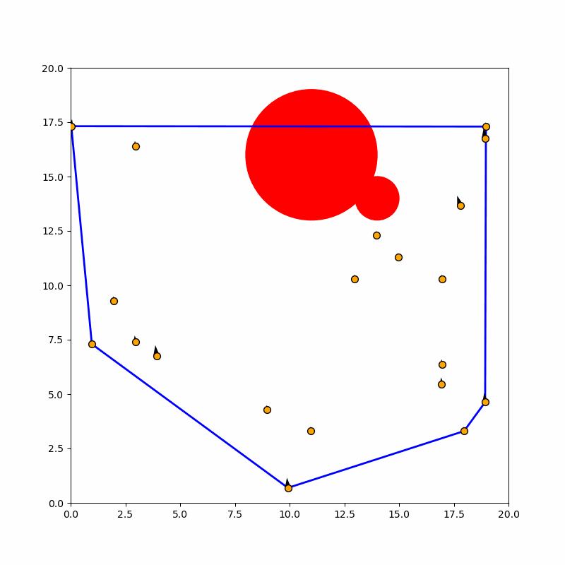

# Tiger Convex Hull Simulation

A Python simulation that visualizes the **Convex Hull** (using the Graham Scan algorithm) dynamically calculated around a set of moving agents ("Tigers"). The simulation includes obstacle collision system and statistical direction generation using CDF logic.

## Demos

| **Uniform Distribution of direction** | **Biased (90°) Normal Distribution of direction** |
|:---:|:---:|
|  |  |

## Features

* **Algorithmic Implementation:**
    * **Graham Scan:** A custom, vector-based implementation of the Graham Scan algorithm to calculate the convex hull in $O(N \log N)$ time.
    * **Polar Sorting:** Custom implementation of angular sorting relative to a reference point using `numpy` vector arithmetic.
* **Agent Dynamics:**
    * **Movement:** Tigers move with individual velocity vectors and direction angles.
    * **Collision Detection:** Agents detect and bounce off circular **Obstacles** and map boundaries.
* **Statistical Logic:**
    * **CDF Generation:** Directional angles can be assigned using **Inverse Transform Sampling** (Uniform or Normal distribution).
    * **Bias Control:** User inputs allow defining a preferred direction (bias) and the intensity of that preference (variance).
* **Real-time Animation:** Visualizes the agents, their movement vectors (quiver plots), static obstacles, and the dynamic convex hull boundary.

## Requirements

This project requires **Python 3** and the following libraries:

* `numpy`
* `matplotlib`

## Installation & Usage

1. Clone this repository or download the script.
2. Install the dependencies using pip:

```bash
pip install numpy matplotlib
